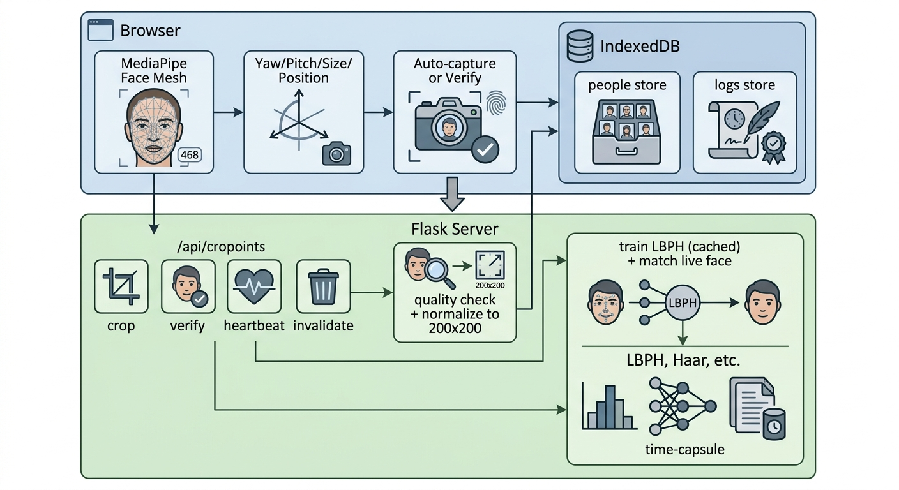

# GZ_Developer | AI/ML Engineer & Software Developer

[](https://gz-developer.netlify.app/)
[](https://github.com/gz089)
[](https://www.linkedin.com/in/gul-zaman-39319025b/)
[](https://web.facebook.com/profile.php?id=100089764673886)
[](https://wa.me/923123456789)

<p align="center">
  
  
  
  
  
</p>


#  Face Recognition Gate

> **Adaptive enrollment + Full-screen access verification**
> Powered by **MediaPipe Face Mesh** + **OpenCV LBPH** + **IndexedDB**

A complete, offline-capable, privacy-first face recognition system for access control — built with just **2 HTML pages** and **1 Flask server**. No cloud. No database. No GitHub storage. All biometric data stays in the user's browser.


##  Features

###  Adaptive Enrollment
- **Real-time face tracking** via MediaPipe Face Mesh (468 landmarks)
- **Auto-guided 3-angle flow**: LEFT → FRONT → RIGHT
- **0.7-second adaptive stability** — pauses instead of resetting on movement
- **Auto burst capture**: 4 samples per angle, no manual clicking
- **Face position guide**: oval overlay + "MOVE CLOSER / MOVE BACK / CENTER FACE"
- **Quality validation**: blur, brightness, contrast checks before saving
- **Multi-face detection**: blocks enrollment if 2+ faces visible
- **Visual feedback**: flash animation + toast on each capture

###  Full-Screen Verification
- Dedicated verification page with **only camera** visible
- Real-time position guidance
- **Auto-detect** → hold 900ms → recognize
- Camera **stops immediately** on result (saves CPU)
- **Full-page result screen**:
  -  Green **"ACCESS GRANTED"** for matches
  -  Red **"NO ENTRY"** for unknowns
- **8-second auto-return** to idle state
- "Verify Next Person" button for high-traffic gates

### Smart Backend
- **LBPH face recognizer** (OpenCV contrib)
- **Model caching** — trains only when samples change
- **Multi-pass face detection** — strict first, looser as fallback
- **Image quality metrics** returned with every crop

### Privacy-First Storage
- All face samples in **IndexedDB** (browser-side)
- All access logs in **IndexedDB**
- **Zero server files** — no `data/` folder, no database
- **Zero cloud dependency** — fully offline once loaded
- **Persistent** across browser refreshes

---

## Quick Start

### Prerequisites

| Requirement | Version | Notes |
|-------------|---------|-------|
| **Python** | 3.8 – 3.11 | 3.12+ may have wheel issues |
| **OS** | Windows 7/10/11, Linux, macOS | Windows 7 needs OpenCV 4.5.5.64 |
| **Browser** | Chrome / Edge / Firefox (latest) | Must support MediaPipe WASM |
| **Webcam** | Any USB or built-in camera | 720p recommended |
| **Internet** | Only for first load | MediaPipe loads from CDN |

### 1️Clone the Repository

```bash
git clone https://github.com/YOUR_USERNAME/face-recognition-gate.git
cd face-recognition-gate
```

### 2️ Create Virtual Environment (Recommended)

**Windows:**
```powershell
python -m venv venv
.\venv\Scripts\Activate.ps1
```

**Linux / macOS:**
```bash
python3 -m venv venv
source venv/bin/activate
```

### 3️ Install Dependencies

```bash
pip install -r requirements.txt
```

**Or manually:**
```bash
pip install flask opencv-contrib-python pillow numpy
```

>  **Important:** Install `opencv-contrib-python` (NOT `opencv-python`) — the LBPH recognizer lives in the `contrib` package.

**Windows 7 users:** Pin OpenCV to an older version:
```bash
pip install "opencv-contrib-python==4.5.5.64"
```

### 4️ Run the Server

```bash
python app.py
```

**Expected output:**
```
============================================================
  Face Recognition Gate — Adaptive Enrollment Server
  OpenCV:        4.5.5
  LBPH available: True
============================================================
Open http://localhost:5000 in your browser
 * Running on http://127.0.0.1:5000
```

### 5️ Open in Browser

| Page | URL | Purpose |
|------|-----|---------|
| **Verification Gate** | http://localhost:5000/ | Access control |
| **Enrollment** | http://localhost:5000/enroll | Register new users |

Allow **camera access** when the browser prompts.

---

## How It Works

### System Architecture

<p align="center">
  
</p>


### Enrollment Flow

```
1. User types name → clicks "Start Auto-Enrollment"
                    ↓
2. Camera opens, MediaPipe starts tracking
                    ↓
3. Face guide oval appears — user positions face
                    ↓
4. When centered → instruction switches to "TURN LEFT"
                    ↓
5. User turns left → stability bar fills (0.7s)
                    ↓
6. Auto burst: 4 samples captured at 350ms intervals
                    ↓
7. Each sample → /api/crop → quality check → save to IndexedDB
                    ↓
8. Toast: "Captured ✓ (1/4)" ... "(4/4)"
                    ↓
9. Auto-switch to "FRONT" → repeat → "RIGHT" → repeat
                    ↓
10. All 12 samples saved → "🎉 ENROLLED!"
```

### Verification Flow

```
1. User clicks "START VERIFICATION"
                    ↓
2. Full-screen camera opens (nothing else visible)
                    ↓
3. MediaPipe tracks face, position guide active
                    ↓
4. Face centered → stability bar fills (0.9s)
                    ↓
5. Browser sends: live frame + ALL enrolled samples
                    ↓
6. Server trains LBPH in memory (cached after first time)
                    ↓
7. Server matches → returns name + confidence
                    ↓
8. Camera stops immediately
                    ↓
9a. MATCH    → Full-page GREEN "ACCESS GRANTED"
9b. NO MATCH → Full-page RED   "NO ENTRY"
                    ↓
10. Logged to IndexedDB, auto-return after 8s
```

---

##  Project Structure

```
face-recognition-gate/
│
├── app.py                  # Flask backend (~200 lines)
│   ├── /api/health         # System status
│   ├── /api/crop           # Crop + quality check
│   ├── /api/recognize      # LBPH matching
│   └── /api/invalidate_model
│
├── templates/
│   ├── index.html          # Verification gate (~650 lines)
│   │   ├── Idle screen
│   │   ├── Full-screen verify
│   │   └── Result screen (granted/denied)
│   │
│   └── enroll.html         # Enrollment page (~700 lines)
│       ├── Camera view
│       ├── Angle chips
│       ├── Live sensors
│       └── Enrolled users list
│
├── requirements.txt        # Python dependencies
├── README.md              # This file
├── LICENSE                # MIT
└── .gitignore             # Ignore venv, cache, etc.
```

---

##  API Reference

### `POST /api/crop`

Receives a face crop from the client (already localized via MediaPipe).

**Request:**
```json
{
  "image": "data:image/jpeg;base64,..."
}
```

**Response (success):**
```json
{
  "success": true,
  "crop": "<base64 PNG>",
  "quality": {
    "ok": true,
    "sharpness": 145.2,
    "brightness": 128.4,
    "contrast": 52.1,
    "issues": []
  }
}
```

**Response (quality fail):**
```json
{
  "success": false,
  "error": "Quality check failed",
  "quality": {
    "ok": false,
    "sharpness": 32.1,
    "brightness": 45.0,
    "issues": ["blurry", "too_dark"]
  }
}
```

### `POST /api/recognize`

Trains LBPH (if needed) and matches live frame.

**Request:**
```json
{
  "image": "data:image/jpeg;base64,...",
  "samples": [
    { "name": "Ahmed", "images": ["<b64 png>", "<b64 png>", ...] },
    { "name": "Sara",  "images": ["<b64 png>", ...] }
  ]
}
```

**Response:**
```json
{
  "success": true,
  "trained_on": 24,
  "cached": true,
  "results": [
    {
      "name": "Ahmed",
      "confidence": 0.92,
      "distance": 8.3,
      "box": { "top": 100, "right": 400, "bottom": 500, "left": 200 },
      "marked": true,
      "authorized": true
    }
  ]
}
```

### `GET /api/health`

**Response:**
```json
{
  "success": true,
  "opencv": "4.5.5",
  "lbph": true
}
```

### `POST /api/invalidate_model`

Forces model retrain on next recognize call. Call this after enroll/delete.

**Response:**
```json
{ "success": true }
```

---

## Configuration

All configurable values are at the top of each file — no build step needed.

### Enrollment (`enroll.html`)

| Constant | Default | Purpose |
|----------|---------|---------|
| `ANGLES` | `['left', 'front', 'right']` | Capture angles |
| `SAMPLES_PER_ANGLE` | `4` | Burst samples per angle |
| `STABILITY_TARGET_MS` | `700` | Time to hold pose (ms) |
| `STABILITY_PAUSE_FACTOR` | `0.6` | Progress decay on movement |
| `BURST_INTERVAL_MS` | `350` | Gap between burst samples |
| `YAW_THRESHOLD` | `0.22` | How far to turn (left/right) |
| `PITCH_THRESHOLD` | `0.18` | How far to tilt (up/down) |
| `CENTER_TOLERANCE` | `0.14` | How strict centering is |

### Verification (`index.html`)

| Constant | Default | Purpose |
|----------|---------|---------|
| `VERIFY_HOLD_MS` | `900` | Stability time before matching |
| `VERIFY_COOLDOWN_MS` | `5000` | Prevent duplicate logs |
| `AUTO_RETURN_MS` | `8000` | Time before returning to idle |

### Backend (`app.py`)

| Constant | Default | Purpose |
|----------|---------|---------|
| `CONFIDENCE_THRESHOLD` | `65` | LBPH distance cutoff (lower = stricter) |

**Tuning tips:**
- **Not recognizing well?** Lower `CONFIDENCE_THRESHOLD` to 75
- **Wrong person recognized?** Raise it to 55
- **Enrollment too slow?** Lower `STABILITY_TARGET_MS` to 500
- **Enrollment less accurate?** Raise `SAMPLES_PER_ANGLE` to 5

---

##  Data Storage

Everything lives in **IndexedDB** in your browser:

### Database: `face_gate_db` (v3)

**Store: `people`**
```javascript
{
  name: "Ahmed",
  samples: ["<b64 png>", ...],     // 12 crops
  angles: ["left", "left", ...],   // angle per sample
  createdAt: "2026-01-15T10:30:00Z",
  updatedAt: "2026-01-15T10:30:00Z"
}
```

**Store: `logs`**
```javascript
{
  id: 1,                            // auto-increment
  name: "Ahmed",
  timestamp: "2026-01-15 10:35:22",
  authorized: true
}
```

### Clearing Data

Open browser DevTools (`F12`) → Application → Storage → IndexedDB → `face_gate_db` → Delete.

Or use the **"Wipe All"** button in the UI.

---

## Troubleshooting

### Server won't start

| Error | Fix |
|-------|-----|
| `ModuleNotFoundError: No module named 'cv2'` | `pip install opencv-contrib-python` |
| `AttributeError: module 'cv2' has no attribute 'face'` | You installed `opencv-python` — uninstall it, install `opencv-contrib-python` |
| `DLL load failed` (Windows 7) | Downgrade: `pip install "opencv-contrib-python==4.5.5.64"` |
| `Address already in use` | Kill Python: `taskkill /F /IM python.exe` (Windows) or `pkill -f app.py` (Linux) |

### Browser issues

| Error | Fix |
|-------|-----|
| Camera doesn't turn on | Click 🔒 icon → Site settings → Camera → Allow |
| Camera in use by another app | Close Zoom, Teams, Skype, Camera app |
| `MediaPipe not loaded` | Check internet connection (CDN needed for first load) |
| `IndexedDB failed` | Try incognito/private mode (some extensions block it) |
| `Non-JSON response` | Check Flask terminal — server crashed |

### Recognition issues

| Symptom | Fix |
|---------|-----|
| "No face detected" every time | Move closer, better lighting, remove glasses |
| Always "NO ENTRY" | User not enrolled, or raise `CONFIDENCE_THRESHOLD` |
| Wrong person matched | Lower `CONFIDENCE_THRESHOLD` to 55-60 |
| Slow verification | Server should cache after first call — check terminal for "cached" |
| Recognition works in enroll but not verify | Different lighting between enroll and verify |

### Windows 7 specific

Windows 7 has **limited wheel availability**. Use these pinned versions:

```bash
pip install "opencv-contrib-python==4.5.5.64"
pip install "numpy==1.23.5"
pip install "Pillow==9.5.0"
pip install "cryptography==3.4.8"
pip install "PyGithub==1.59.1"
```

>  **Better option:** Upgrade to Windows 10/11, or use Linux/WSL2.

---

## Privacy & Security

| Aspect | Detail |
|--------|--------|
| **Face data location** | Browser IndexedDB only |
| **Server storage** | None — server is stateless |
| **Network** | Face images POSTed to `localhost` only |
| **Third-party** | MediaPipe loads from jsDelivr CDN (Google's model, no data sent) |
| **HTTPS** | Not required for `localhost` (browser allows camera on localhost) |
| **Multi-user** | Each browser profile has its own data |
| **Backup** | Export CSV for logs; samples can't be exported (biometric privacy) |

**Recommendations:**
- Run behind a **firewall** — bind only to `127.0.0.1` for single-machine use
- For LAN access, use **HTTPS** (required by some browsers for camera)
- **Never** expose this directly to the internet without authentication

---

##  Deployment

### Local Network (LAN)

Change `app.py` last line:
```python
app.run(host="0.0.0.0", port=5000)
```

Access from phone/tablet: `http://<your-pc-ip>:5000`

> ⚠️ Some browsers block camera on non-HTTPS non-localhost URLs. Use Chrome with `chrome://flags/#unsafely-treat-insecure-origin-as-secure` if needed.

### Production (Gunicorn / Waitress)

**Linux:**
```bash
pip install gunicorn
gunicorn -w 1 -b 0.0.0.0:5000 app:app
```

**Windows:**
```bash
pip install waitress
waitress-serve --port=5000 app:app
```

> **Important:** Use `-w 1` (single worker) — the model cache is in-memory and per-process.

### Docker

**Dockerfile:**
```dockerfile
FROM python:3.11-slim

RUN apt-get update && apt-get install -y \
    libgl1 libglib2.0-0 libsm6 libxext6 \
    && rm -rf /var/lib/apt/lists/*

WORKDIR /app
COPY requirements.txt .
RUN pip install --no-cache-dir -r requirements.txt

COPY . .
EXPOSE 5000
CMD ["python", "app.py"]
```

**Build & run:**
```bash
docker build -t face-gate .
docker run -p 5000:5000 face-gate
```

---

##  Requirements

### `requirements.txt`

```txt
Flask>=2.0.0
opencv-contrib-python>=4.5.5.64
Pillow>=9.0.0
numpy>=1.21.0
```

### Downloading Requirements

Create `requirements.txt` in the project root with the content above, then:

```bash
pip install -r requirements.txt
```

**To generate your own** (if you add libraries):
```bash
pip freeze > requirements.txt
```

---

## Testing

### Test Server Health

```bash
curl http://localhost:5000/api/health
```

Expected:
```json
{"success": true, "opencv": "4.5.5", "lbph": true}
```

### Test Face Detection (Standalone)

Save as `test_detect.py`:
```python
import cv2

cap = cv2.VideoCapture(0)
cascade = cv2.CascadeClassifier(
    cv2.data.haarcascades + "haarcascade_frontalface_default.xml"
)

print("Press ESC to quit")
while True:
    ret, frame = cap.read()
    if not ret: break
    gray = cv2.cvtColor(frame, cv2.COLOR_BGR2GRAY)
    gray = cv2.equalizeHist(gray)
    faces = cascade.detectMultiScale(gray, 1.1, 4, minSize=(40, 40))
    for (x, y, w, h) in faces:
        cv2.rectangle(frame, (x, y), (x+w, y+h), (0, 255, 0), 2)
    cv2.putText(frame, f"Faces: {len(faces)}", (10, 30),
                cv2.FONT_HERSHEY_SIMPLEX, 1, (255, 255, 255), 2)
    cv2.imshow("Test", frame)
    if cv2.waitKey(1) & 0xFF == 27: break

cap.release()
cv2.destroyAllWindows()
```

Run: `python test_detect.py`

---

##  Contributing

1. Fork the repo
2. Create a feature branch: `git checkout -b feature/amazing-feature`
3. Commit: `git commit -m 'Add amazing feature'`
4. Push: `git push origin feature/amazing-feature`
5. Open a Pull Request

---

##  License

MIT License — see [LICENSE](LICENSE) file.

Free to use, modify, and distribute for personal and commercial projects.

---

##  Credits

- **MediaPipe Face Mesh** — Google AI (Apache 2.0)
- **OpenCV** — Intel / OpenCV.org (Apache 2.0)
- **LBPH Algorithm** — Timo Ahonen et al.
- **Flask** — Pallets Projects (BSD)
- **IndexedDB** — W3C standard, native in all modern browsers

---

##  Star History

If this project helped you, please ⭐ the repo!

---

## Support

- **Issues:** [GitHub Issues](https://github.com/YOUR_USERNAME/face-recognition-gate/issues)
- **Discussions:** [GitHub Discussions](https://github.com/YOUR_USERNAME/face-recognition-gate/discussions)

---

<p align="center">
  Made with Love by developers who care about privacy
</p>
